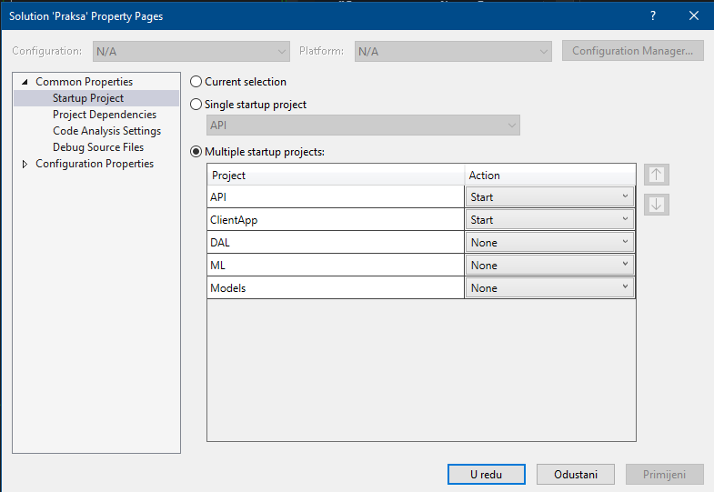

# Description and requirements
---
## Description
This repository contains the whole code (which was written in .NET and React) and database implementation in PostgreSQL for a web app for keeping records of students proffesional practice which was created for final paper at Faculty of Informatics and Digital Technologies.

---

## Requirements

For using this web app you need to install and have:
<li> node
<li> yarn
<li> postgreSQL 

After making sure you have all the needed instalations you have to create a new database in PostgreSQL.

Then you have to create a new file inside of the API project and name it "appsettings.Development.json" and put the following code inside it:
```
{
  "Authentication": {
    "JWT": {
      "SecretKey": "", // 128 bit key = mora imati length 16
      "ExpirationInSeconds": 30,
      "Issuer": "Praksa",
      "Audience": "Praksa"
    }
  },
  "ConnectionStrings": {
    "DefaultConnection": "" // tu ide connection string na napravljenu postgresql bazu
  }
}
```

Here you have to define a secret key for JWT tokens which has a minimum length of 16 characters and connection string for created database in PostgreSQL which usually looks like (change values after "=" to be valid for your implementation):
```
 "Server=serverName;Port=portNumber;Database=databaseName;User Id=userId;Password=password;"
```

After configuring those settings, open the terminal of your editor and write command:
```
cd ClientApp
```
to move to the project of React app and then write command:
```
yarn install
```
to install all necessary dependencies.

The last step, before building and running the app, includes:
1. Right click on the Solution and choose Properties
2. Configure the properties to look the same as in the picture:



Now you are ready to use the web app, enjoy!
